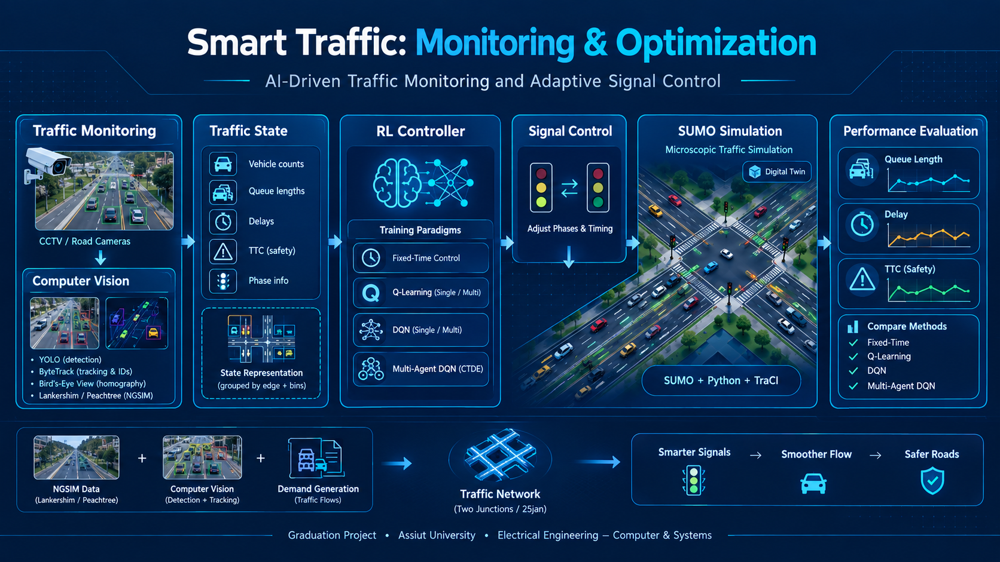
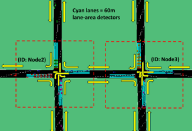
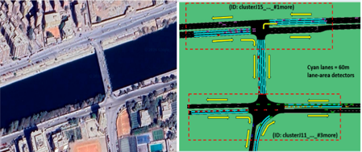
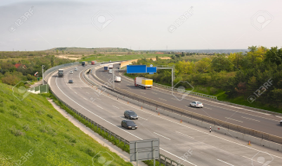
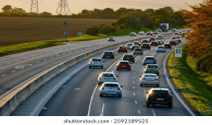
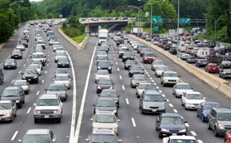
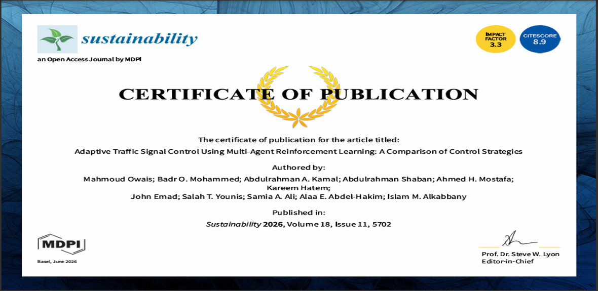
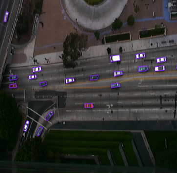

# smart-traffic-monitoring-optimization

## Project Overview

### Introduction 

Adaptive Traffic Signal Control Using Multi-Agent Reinforcement Learning. Developed an intelligent traffic signal control system using Multi-Agent Reinforcement Learning (MARL) with Centralized Training and Decentralized Execution (CTDE). Designed and simulated urban traffic networks in SUMO to evaluate adaptive signal control under different traffic scenarios. Integrated a Computer Vision pipeline using YOLO for real-time vehicle detection and multi-object tracking, combined with Bird's-Eye View (BEV) transformation to estimate inter-vehicle distances. Compared multiple traffic control strategies using performance metrics including average waiting time, queue length, throughput, and travel time. Combined Reinforcement Learning and Computer Vision to improve traffic efficiency through perception-driven adaptive signal control.

#### architecture diagram 

**Smart Traffic: Monitoring and Optimizing Traffic Using Artificial Intelligence and Machine Learning**

*Graduation Project, Faculty of Engineering, Assiut University*

The project replaces rigid fixed-time traffic signals with an adaptive system that sees traffic through cameras, learns how to control signals through reinforcement learning, and acts by extending or switching green phases in real time. It combines a multi-agent reinforcement learning controller (evaluated in the SUMO simulator) with a computer vision pipeline that turns roadside video into queue and demand data.

> **Published paper:** *Adaptive Traffic Signal Control Using Multi-Agent Reinforcement Learning: A Comparison of Control Strategies* (MDPI *Sustainability*) (https://www.mdpi.com/2071-1050/18/11/5702)

---

### The Problem

- Conventional signals use predefined timing plans and rigid cycles, so they cannot react to real-time fluctuations or asymmetric demand.
- Under high demand and oversaturation, fixed-time control breaks down: unnecessary stops, rapidly growing delay, and long queues.
- The consequences are longer travel times, higher fuel consumption, increased CO₂ emissions, economic losses, and delayed emergency vehicles.

### Our Solution: Eyes, Brain, Action

- **The Eyes (Perception):** computer vision turns live camera feeds into queue data and traffic demand.
- **The Brain (Learning):** autonomous AI agents learn to minimize delay or queue length through trial and error instead of following a fixed clock.
- **The Action (Execution):** each agent decides to either maintain the current green phase or switch to the next one, clearing traffic bursts and preventing gridlock.

---

### Reinforcement Learning Signal Control

We implemented and compared three strategies, each in single-agent and multi-agent form, with either a queue-based or delay-based reward.

| Strategy | Type |
| --- | --- |
| Fixed-Time Control | Baseline (no learning) |
| Tabular Q-Learning (Single agent / Multi agent) | Value-based RL |
| Deep Q-Network (DQN / MADQN) | Deep value-based RL |

### Tabular Q-Learning

- A lightweight, interpretable method that updates an explicit Q-table using the Bellman equation.
- Uses an epsilon-greedy policy to balance exploring new phase actions with exploiting what it has learned.
- Queue counts from lane detectors are discretized into four bins (0, 1–9, 10–18, and more than 18 vehicles) to avoid state-space explosion.

### Deep Q-Network (DQN)

- The natural evolution of Tabular Q-Learning: the Q-table is replaced by a neural network (TensorFlow/Keras), so continuous states and large state spaces are handled.
- Adds a replay buffer, mini-batch neural network training, and a target network updated gradually with soft updates for stability.

### Single-Agent vs. Multi-Agent

- **Single-agent:** one central brain controls all intersections, which does not scale well as the network grows.
- **Multi-agent:** each intersection gets its own agent (own network, replay buffer, and target network for DQN) and acts on local observations.
- Multi-agent controllers follow **Centralized Training with Decentralized Execution (CTDE)**: agents train with shared global information but each traffic light chooses its own action at execution time.
- Agents coordinate indirectly through the shared traffic environment, since a green light at one intersection changes the arrivals at its neighbor.

---

### Simulation Networks

- **Synthetic Two-Junction Corridor:** a symmetric two-intersection corridor built entirely in SUMO, used to observe multi-agent coordination without real-world irregularities.
- 

- **25 January Corridor (Assiut, Egypt):** a digital twin of a real arterial corridor with asymmetric geometry and realistic turning movements, used to test controller robustness.
- 

                
### Demand Scenarios 
- **Low Demand view:** 

  

- **Medium Demand view:**  

  

- **High Demand view:**  

   

| Level | Volume | Represents |
| --- | --- | --- |
| Low | ~42 veh/hr/lane | Off-peak (early morning, late night) |
| Medium | ~350 veh/hr/lane | Standard urban arterial operation |
| High | 840–1,400 veh/hr/lane | Peak congestion and saturation stress test |

---

### RL Control aganist Baseline_fixed_time control

- **RL_Control.mp4**

- **Baseline_fixed_time control.mp4**

 

### Safety: Time-To-Collision (TTC)

- TTC measures how long until a following vehicle would hit its leader if both keep their speeds.
- It is used as an evaluation-only safety check, not as part of the reward, because improving it does not guarantee less delay or shorter queues.
- It should always be read alongside delay and queue metrics.

---
### Published Research
   Our research paper "Multi-Agent Deep Reinforcement Learning for Adaptive Traffic Signal Control under Variable Traffic Demand"has been officially published in the Sustainability journal (MDPI) with Scopus - Q1 and Web of Science – Q2.

   This publication also represents a major outcome of our Graduation Project and reflects the dedication and collaboration of our entire team.

   What our research focused on :

    Our work addresses one of today's most important urban challenges: traffic congestion.

    We proposed an intelligent traffic signal control framework based on Multi-Agent Deep Reinforcement Learning (MARL), enabling multiple intersections to cooperate and optimize traffic flow in real time rather than   
    operating independently.
    
    The system was designed, implemented, trained, and evaluated using realistic traffic simulations to improve traffic efficiency under varying traffic conditions.
    
- **Publication Banner:**
- 
 

- **Publication Certificate:**
  
 

### Computer Vision Pipeline

The vision side of the project turns roadside video into the data the controllers need. It is built on the NGSIM traffic dataset (Peachtree Street and Lankershim Boulevard).

### Homography and Bird's-Eye View (BEV)

- A homography maps camera coordinates onto a ground plane, giving a top-down view of the road.
- This removes perspective distortion, makes distances comparable across the frame, and gives tracking and collision analysis one consistent coordinate system.
- Built with manual point correspondences between NGSIM video and Google Earth imagery, `findHomography()` with RANSAC, and `warpPerspective()`.
- Challenges: manual point picking, 2005 footage versus modern imagery, curved roads, the single-plane assumption, and buildings that stay distorted.

**BEV.mp4**

   

### Vehicle Detection and Tracking

- Custom YOLO model trained on 260 annotated frames (single "vehicle" class, 70/20/10 train/validation/test split, augmentation to avoid overfitting), trained on Google Colab GPUs via Roboflow.
  
- **Annoted frame Example:**

- Works on low-resolution 480p footage, which supports deployment on standard CCTV cameras.
- ByteTrack assigns persistent IDs across frames and handles occlusion in dense traffic, with a live HUD showing vehicle counts and elapsed time.

**Tracking.mp4**
 

### Nearest-Neighbor Distance Estimation

- For every tracked vehicle, the bottom-center point is projected into real-world coordinates, and the nearest neighboring vehicle and its distance are computed from a single camera.
- Each vehicle is shown with a colored safety line: **red** (under 2 m), **orange** (under 5 m), **yellow** (under 10 m), **green** (over 10 m).

**Distance.mp4**

   

### Automated Demand Generation

- Video is divided into polygonal regions matched to the entry and exit edges of the SUMO network; vehicle centroids are checked against them to record each vehicle's origin and destination.
- A rolling 15-frame history (about 0.5 s) flags vehicles that moved less than 5 pixels as stopped, giving a real-time queue length.
- Origin-destination pairs are validated against physically possible maneuvers, and impossible trajectories (from occlusion or ID switches) are dropped.
- The result is exported as a SUMO `.rou.xml` file using `<trip>` definitions, a conservatively filtered approximation of real traffic that keeps the digital twin realistic and stable.

**Demand_Generation.mp4**
 

---

### Limitations and Future Work

**Limitations**

- Evaluated in simulation only (SUMO).
- Single reward objective per controller.
- No communication between decentralized agents during execution.
- Vision components rely on older, low-resolution NGSIM footage.

**Future work**

- Dueling DQN and Noisy Networks
- Real-world deployment
- Full digital twin implementation
- Towards smart traffic management in Egypt

### Team Members

| Name |
| --- |
| Abdulrahman Ali Mohamed Kamal |
| Abdulrahman Shaban Mohamed Farghly |
| Ahmed Hamdy Mostafa Mohamed |
| John Emad Fawzy Eskander |
| Kareem Hatem Hashem Hassanein |
| Salahelden Talaat Younis Elsayed |

### Supervision and Discussion Committee

- Prof. Dr. Samia Abdel Fattah Ali
- Prof. Dr. Alaa El-Din Abdel Hakim Mohamed
- Prof. Dr. Mahmoud Mohamed Owais
- Dr. Islam Mohamed El-Qabbani

---

### Tech Stack

SUMO · Python · TraCI · TensorFlow/Keras · OpenCV · YOLO · ByteTrack · Roboflow · Google Colab · Git/GitHub · LaTeX

### License

Submitted under Creative Commons Attribution (CC BY 4.0).
